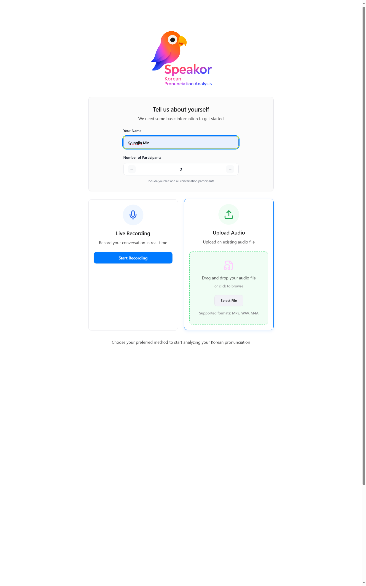
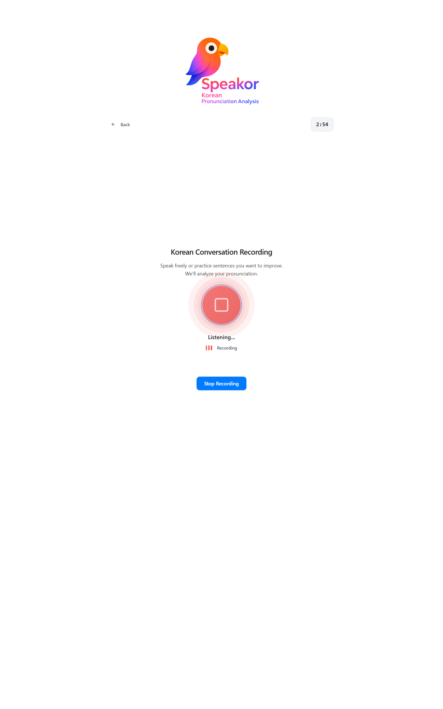
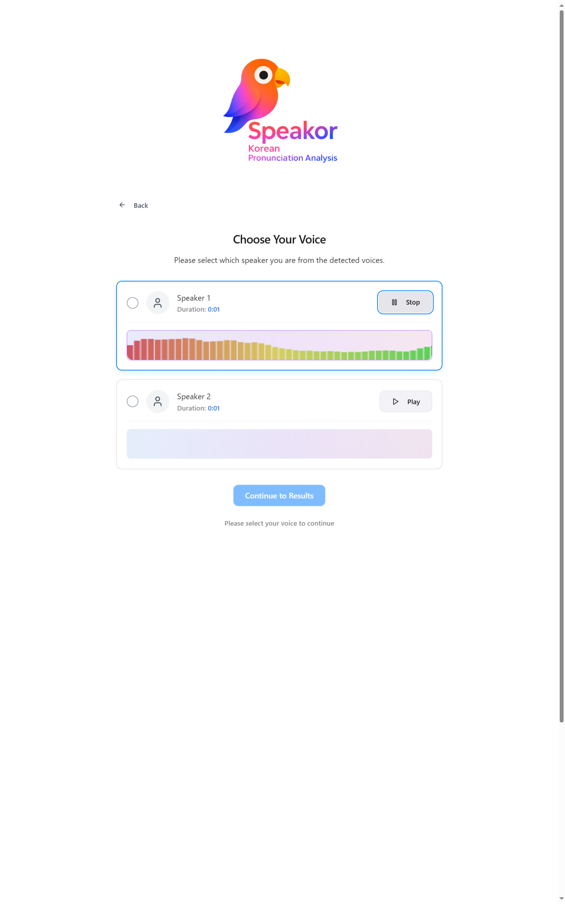
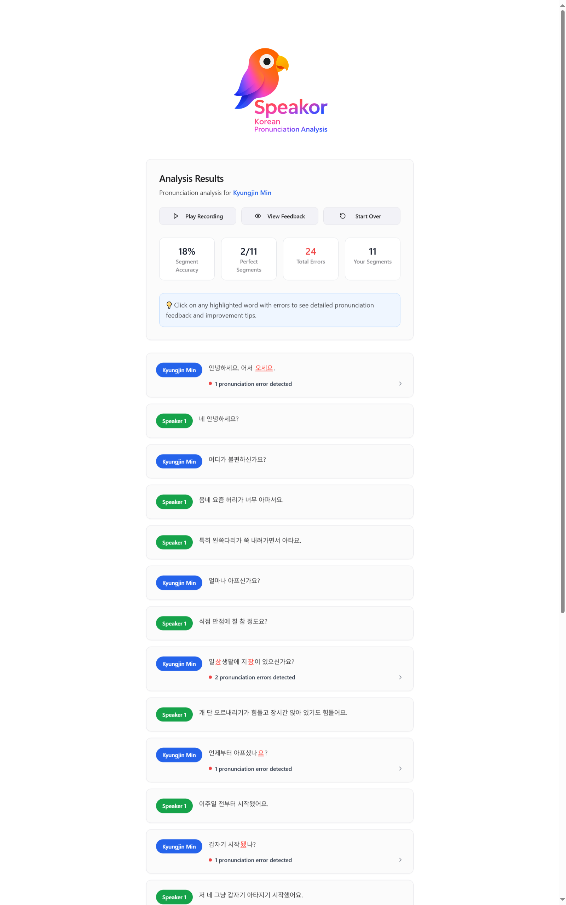
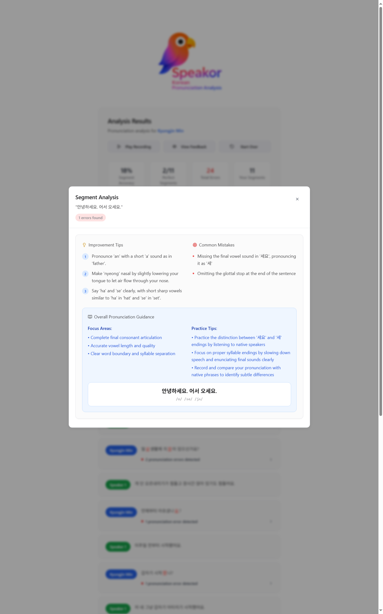
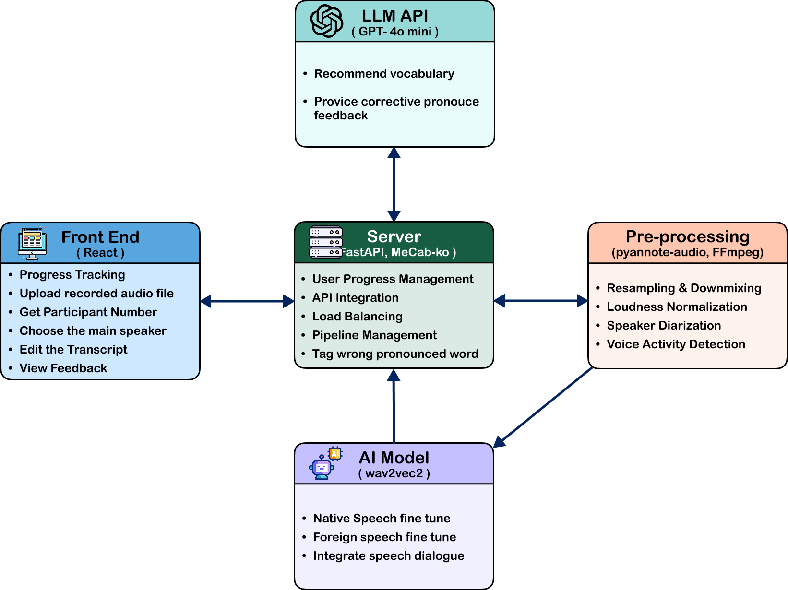
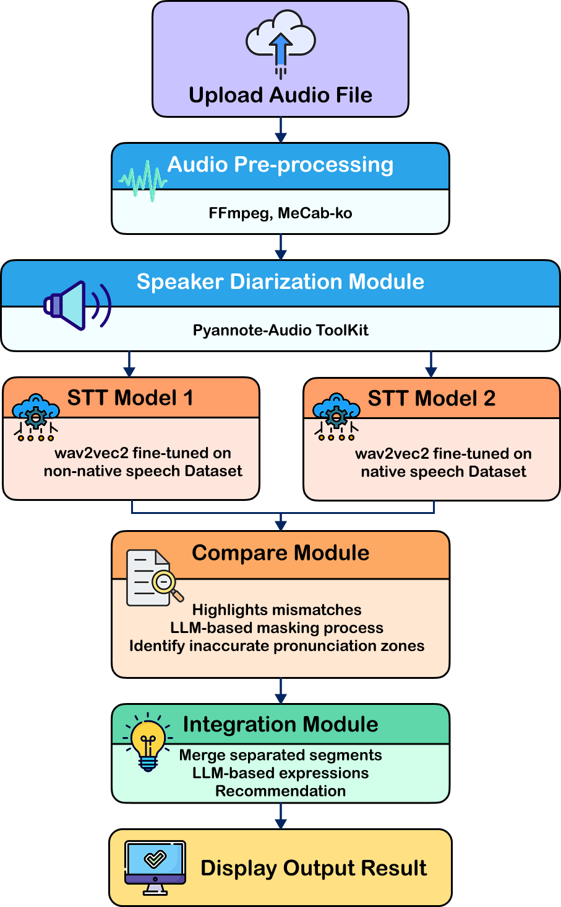

# Speakor - Korean Pronunciation Analysis

AI 기반 한국어 발음 분석 및 피드백 시스템으로, STT Model을 활용하여 한국어 학습자의 발음을 정확하게 분석하고 개선사항을 제공합니다.

## 프로젝트 소개

**Speakor**는 **kresnik/wav2vec2-large-xlsr-korean 기반 STT(Speech-to-Text)** 및 **LLM 기반 발음 분석**을 통해 한국어 학습자에게 맞춤형 발음 피드백을 제공하는 웹 애플리케이션입니다. 실시간 녹음과 파일 업로드를 지원하며, 화자 분리 기술을 통해 다중 화자 환경에서도 정확한 분석이 가능합니다.

## 주요 기능

- **다양한 입력 방식**: 실시간 녹음 또는 오디오 파일 업로드 지원
- **화자 분리**: pyannote-audio를 활용한 정확한 화자 분리 및 선택
- **AI 기반 분석**: wav2vec2 STT + LLM을 통한 정밀한 발음 분석
- **상세 피드백**: 발음 오류 하이라이트, IPA 표기, 개선 팁 제공
- **학습 통계**: 세그먼트 정확도, 오류 분석 등 시각적 통계 제공

## 서비스 플로우

### 1. 메인 페이지 - 사용자 정보 입력

사용자 이름과 참여자 수를 입력하고, 실시간 녹음 또는 파일 업로드 방식을 선택합니다.

### 2. 실시간 녹음 (선택적)

브라우저를 통한 실시간 음성 녹음 기능을 제공합니다.

### 3. 화자 선택

AI가 분리한 화자 중에서 분석 대상이 될 본인의 음성을 선택합니다.

### 4. 분석 결과

세그먼트별 대화 내용과 발음 오류를 시각적으로 표시하며, 전체 통계를 제공합니다.

### 5. 상세 피드백

선택한 세그먼트에 대한 상세한 발음 분석, 개선 팁, 연습 방법을 제공합니다.

## 시스템 아키텍처

본 시스템은 다음과 같은 구조로 구성됩니다:

- **Frontend (React)**: 사용자 인터페이스 및 진행 상태 관리
- **Server (FastAPI)**: API 통합, 세션 관리, 파이프라인 조율
- **Pre-processing**: 오디오 전처리, 화자 분리, 정규화
- **AI Model (wav2vec2)**: 원어민/비원어민 음성 데이터로 파인튜닝된 STT 모델
- **LLM API**: 발음 분석 및 피드백 생성

## 처리 플로우

**전체 처리 과정:**
1. **Upload Audio File** → 오디오 파일 업로드
2. **Audio Pre-processing** → FFmpeg, MeCab-ko를 통한 전처리
3. **Speaker Diarization** → Pyannote-Audio Toolkit을 활용한 화자 분리
4. **STT Processing** → 원어민/비원어민 데이터로 파인튜닝된 wav2vec2 모델
5. **Compare Module** → 두 STT 결과 비교 및 오류 식별
6. **Integration Module** → LLM 기반 종합 분석 및 피드백 생성
7. **Display Output Result** → 최종 결과 표시

## 기술 스택

### **Frontend**
- **React 18** + **TypeScript**
- **Vite**
- **Tailwind CSS**
- **shadcn/ui**
- **React Router DOM**

### **Backend & AI**
- **FastAPI**
- **kresnik/wav2vec2-large-xlsr-korean** (Facebook의 Self-supervised Speech Recognition 모델)
- **pyannote-audio** (화자 분리 및 음성 분할)
- **FFmpeg** (오디오 처리 및 변환)
- **MeCab-ko** (한국어 형태소 분석)

## 개발자 정보

<table>
    <tr height="160px">
        <td align="center" width="160px">
            
             
            <a href="https://github.com/KJ-Min"><strong>민경진</strong></a>
             
        </td>
        <td>
            <strong>Frontend Developer</strong> 
            • React + TypeScript 기반 전체 프론트엔드 개발 
            • 사용자 인터페이스 설계 및 구현 
            • API 연동 및 상태 관리 
            • 반응형 웹 디자인 구현 
            • 실시간 녹음 기능 개발 
            • 데이터 시각화 및 피드백 UI 구현
        </td>
    </tr>
</table>